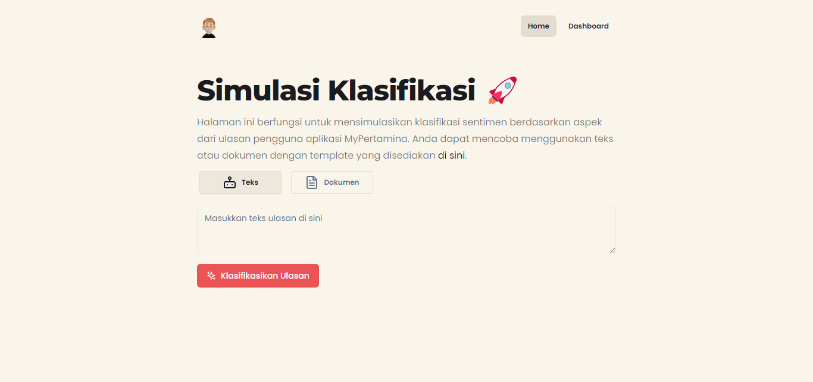

# Sentiment Analysis Simulation

This is Next.js website that serves as a tool to simulate the sentiment and aspect classification process of a review text using Support Vector Machine (SVM) algorithm.

Live example hosted on Vercel: https://sentext.vercel.app/
Backend API hosted on railway: **_currently unavailable because limit of railway free tier_**

NOTE: The backend API project is private because it contains the algorithm code and the dataset used to train the algorithm.



## 🖥️ Running Locally

1. Clone this repo

   ```bash
   https://github.com/Ikram-Maulana/sentiment-analysis-simulation.git
   ```

2. Install dependencies

   ```bash
   yarn install
   ```

3. Add your `PUBLIC_API_API_URL` to your `.env.local` file with your API backend URL as the value.

   ```bash
    PUBLIC_API_API_URL=...
   ```

4. Run the development server

   ```bash
   yarn dev
   ```

5. Open [http://localhost:3000](http://localhost:3000) with your browser to see the result.

## 🚀 Deploy Your Own

1. Clone this repo

   ```bash
   https://github.com/Ikram-Maulana/sentiment-analysis-simulation.git
   ```

2. Configure project with [Vercel](https://vercel.com)

3. Add your own backend API with your own algorithm to your [Vercel Project Environment Variables] (https://vercel.com/docs/environment-variables) with `PUBLIC_API_API_URL` as the key and your API URL as the value.

4. Do final deploy with Vercel

## 🧑‍💻 Credit

- [Ikram Maulana](https://github.com/ikram-maulana) as Full Stack Web Developer and Machine Learning Engineer
